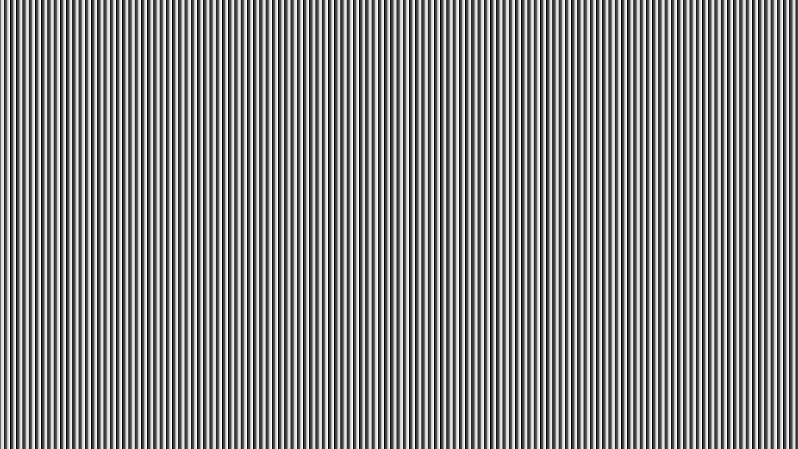
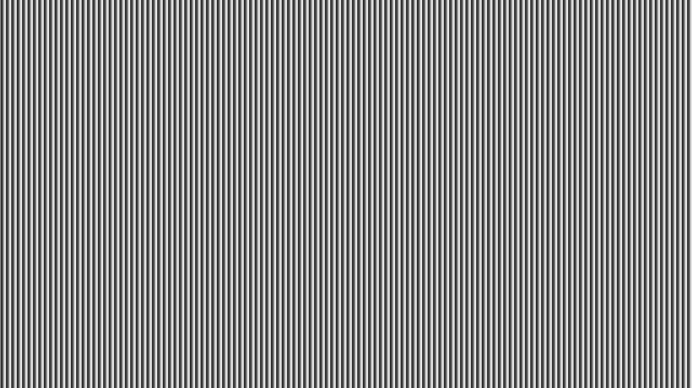

# Kivi Assignment - CV Engineer

## 1. Implementing the Double Three-step Phase-shifting Algorithm

### Resultant Phase Images

#### Phase Image 1

#### Phase Image 2

#### Averaged Phase Map

> The **1.3 Phase Unwrapping** couldn't be completed because of the lack of knowledge of me about the topic. 
> Instead of wasting time to learn this, other objects are completed. So there is no unwrapped phase image.

## 2. Implementation of a 3-D Bilateral Filter for Point Clouds

The code is completed and working well. It lasts long and depending on some time constraints, the resultant 
images couldn't be taken. This part will be completed very soon by the means of result images.

## 3. Correspondence Matching

For correspondence matching, **Sum of Squared Difference** algorithm is analyzed and used. The paper below is 
a reference:
[https://ieeexplore.ieee.org/document/7449303](https://ieeexplore.ieee.org/document/7449303)

The resultant disparity map image can be found below.

